# Sentiment-Analysis-Yelp-Reviews
## Project Goal
The purpose of this study is to analyze the sentiment behind Yelp reviews for restaurants in the Las Vegas, Nevada area. We started by contructing our basetable from the data source (Yelp public dataset, Kaggle) and exploring the data using different methods. Then, we applied the dictionary-based lookup approach for sentiment analysis, and finally we ran different machine learning models, using the stars given for each review as the label for the dependient variable, and the words as the predictors. Finally, we evaluated the models and compared their performance.

## Content

1. Basetable
2. Data Exploration - Wordclouds
3. Sentiment Analysis - First Insights
4. Dictionary-Based Lookup Approach
5. Machine Learning Approach
6. Conclusion

## 1. Basetable
We started by trying to get the data with the Yelp API, but as there are limitations regarding the information you can get from it (max. 3 reviews per user and 1.000 reviews per city), we decided to make use of the public dataset available in Kaggle. In this line, we download the tables "Yelp_Business" and "Yelp_Review" files and imported them in R. Then we merged both tables and finally filtered by `city` = "Las Vegas", `category` = "Restaurant" and `useful` > 3. This last filter means that only reviews which were voted useful more than 3 times were considered for the analysis.

## 2. Data Exploration - Wordclouds
We started with worldclouds for both general words in the reviews and as well as restaurant categories. The aim is to get some insights into the most frequent terms before getting into the sentiment analysis, in order to understand better the nature of the data. We considered only the words and categories that appear more than 300 times.

### Wordcloud for all reviews

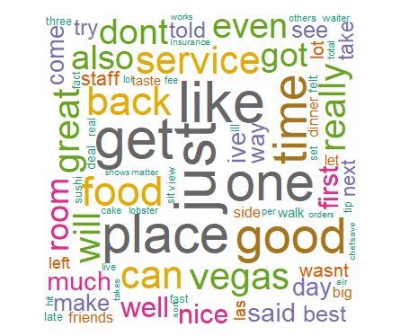

We can see that the words "food", "place", "like" and "good" are among of the most frequently used in the reviews. This will be used later on to get more insights on the relationships between the words.

### Wordcloud for categories

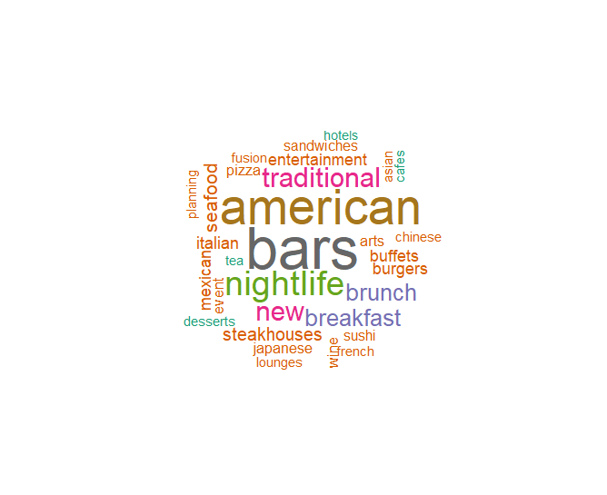

We can see that "bars" are the most frequent category amongst restaurants, so from this we can infer that many restaurants in Las Vegas are likely to also have a bar. "American" and "Nightlife" also appear into the most frequent categories.

## 3. Sentiment Analysis - First Insights

### Bigrams to Map Relationships between words
We started by identifying 3 key words ("food, "place" and "service") that are significant in the restaurant industry. Then we built bigrams to find relationships between these key words and the entire review content. The methodology used was to consider only the combination of words that have a total frequency of more than 30. 

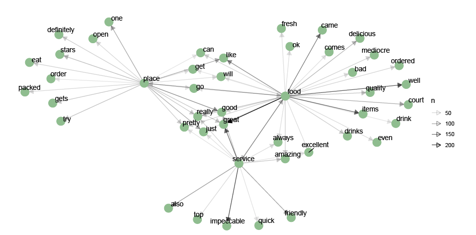

As we can see, this approach allows as you to clearly visualize which relationships between words are stongest. The darker the rrow indicates arrows the strongest relationships. For instance, we can see that food is highly-correlated with great and well, place with good and service with impeccable and friendly.

### Map emotions for each star rating
In this step to map how different star ratings are related with different emotions, we used "nrc" lexicon from `get_sentiments` function and plotted a radar chart using `chartJSRadar` function. The key emotions included in this lexicon dictionary are joy, trust, disgust and anger.

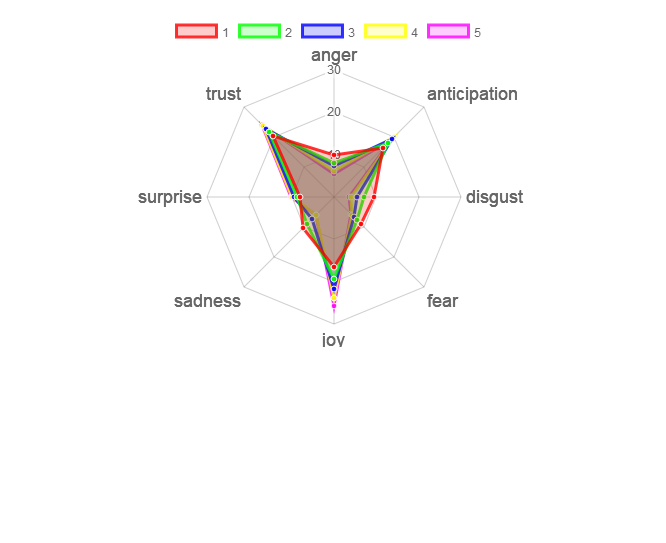

As we can see, 5 star reviews are most associated with joyous feelings and least associated with anger and disgust. On the other hand, low review rates have higher correlation with disgust, sadness and anger feelings. Even if the differences in the map are not that large, is a good first approach to understand the main emotions behind the reviews based on the star ratings.

## 4. Dictionary-Based Lookup Approach

After gaining some initial insights into the nature of the review data, we evaluated the sentiment of the review words according to the "bing" dictionary, which classifies words as either positive or negative. Below you will see a bar plot of the number of words with a positive versus negative sentiment per level of star rating.

### Word sentiment per star level

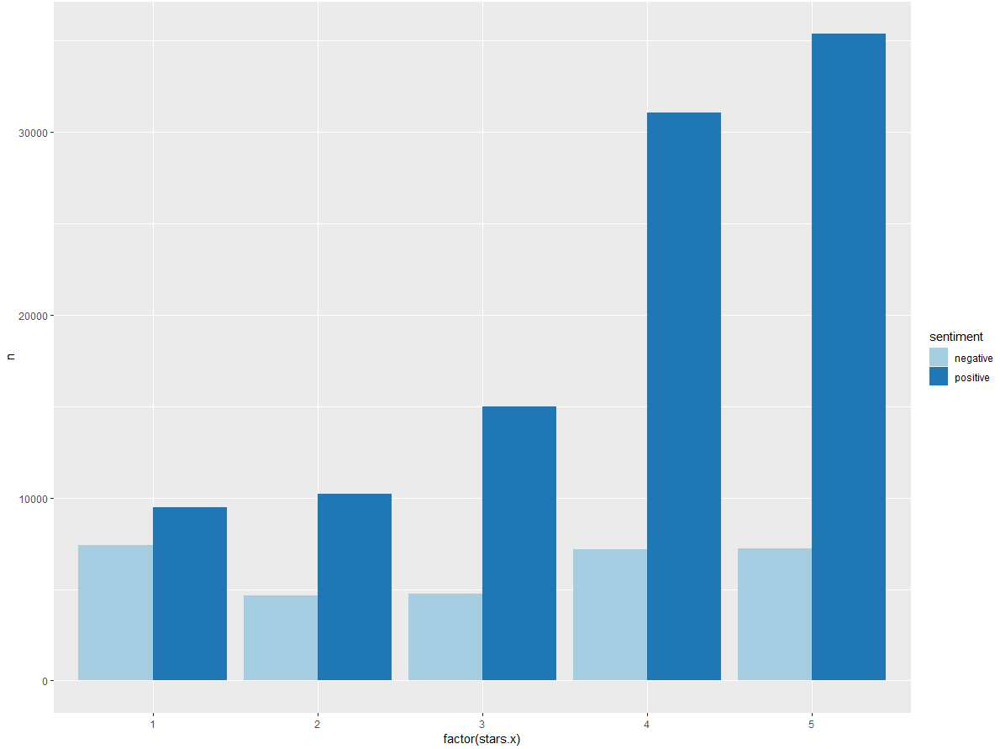

While important, the results here should perhqps come as no surprise, as one should expect that as the review star level increases, so too should the overall number of positive words in those reviews. One interesting insight is that the number of positive words within 1 star reviews is on par with the amount of negative words. Overall, with this bing dictionary unigram approach, the overall sentiment of the reviews is seen as quite positive.

### Dictionary based approach using SENTIMENTR package
We also tested sentimentr package with inbuilt dictionary based text analysis  for comparing rating to text and it was positive. For this we separated the reviews in 5 cartegories based on star and found correation betweeen user ratings and text score through sentimentr package. we can see the mean .for 1 star as -0.02612, 2 as .03571 and for 5 high as 0.24, the baseline sentimentr uses is zero .
The two graphs below show the positive sentiment on the right side for 5 rating and more negative sentiment for 1 rating.

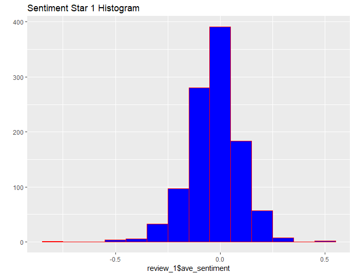

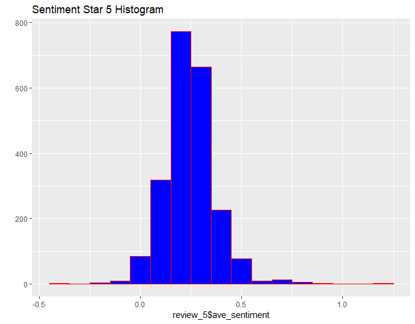

## 5. Machine Learning Approaches

Approaching Sentiment Analysis from a machine learning perspective was admittedly the most time-consuming and thus we will discuss several methods we used and the results observed.

### 1st approach
This approach consist on creating 2 boolean dependent variables based on the ratings assigned by users, `Positive` and `Negative`. The first one will be TRUE for reviews rated >= 4 and the second one will be TRUE for those reviews rated >= 2. The idea is to measure the sentiment behind the "strong" emotions, that's why we exclude from the analysis those reviews that are more "neutral". Before running the models, we applied different functions to clean the data for the text analysis, which includes removing punctuation, numbers and strip white space, transform text to lowercase, stem the document and remove stop words. It's also important to mention that we will just keep the terms that appear in 10% or more of the reviews. This was taken in order to make more enfasis on those terms that have more frequency, and also to have less variables for the models so they can run faster. Every model will be applied for positive and negative sentiments separately.

**Decision Trees**
We start applying decision trees model. We run 2 models, 1 using the `Negative` variable as the dependent variable and all the other features as independent, and same for the other model but with `Positive` as the dependent variable. Then we predict our model and compare it with the test sample, and we finally get the confusion matrix and accuracy of the model, as presented below.

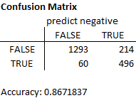
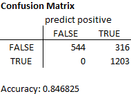

As we can see, the model accuracy is quite good, as in around 85% of the times the prediction is correct. However, is important to take into account the baseline model and compare with it, as the accuracy by itself can show a bias result given that in some cases just because of the nature of the data, we can have high accuracy randomly, just because most of the values for the dependent variable are "TRUE". In this line, we build the baseline model, which has an accuracy of  0.73 for negative values and 0.58 for the positive ones. This means that actually the positive model performs better than the negative one, as even if it's accuracy is lower, in relative terms (that is, compared to the baseline model) is higher. 

**Random Forest**
For random forest, again we run the model, made the predictions and constructed the confusion matrix, calculating also the model accuracy.

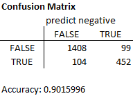
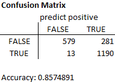

In this case we can observe that the model performs better than the decision trees, with an accuracy of 0.90 and 0.86 for the negative and positive models, respectively. However, is interesting to discuss whether or not can be some overfitting in this models.

**Logistic Regression**
Lastly, we run the logistic regression model. For this model, we also construct the ROC curve to show visually how the model perfoms and to compare both the positive and negative models in one chart.

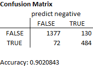
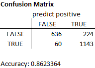
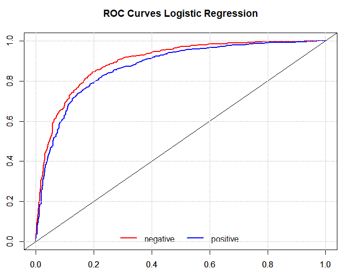

We can observe that the accuracy of this model is very similar to the random forest, even slightly better. If we see the ROC curves, we can see that the negative one performs slightly better than the positive, and the AUC area is quite high. So, we could conclude that this model performs good in order to predict if the sentiment behind the words is positive or negative, which could be used to predict sentiment of other reviews for the future.

### 2nd approach
In this approach we tried to replicate machine learning alogithms taught in the class, applied for this case. We run random forest algorithm, diving the data into train/test set and tested with multiple sizes 70/30 and 60/40. We also divided the data based on star rating and tested, the best performance we got was using positive rating above 4 and everything. We did the text analysis taking the proper processes which included building the dtm matrix and cleaning the data. After running the models, we got an accuracy of 59% for star rating positive more or equal to 4, and negative less or equal to 1. Also the train/test ratio for this model was 60/40.

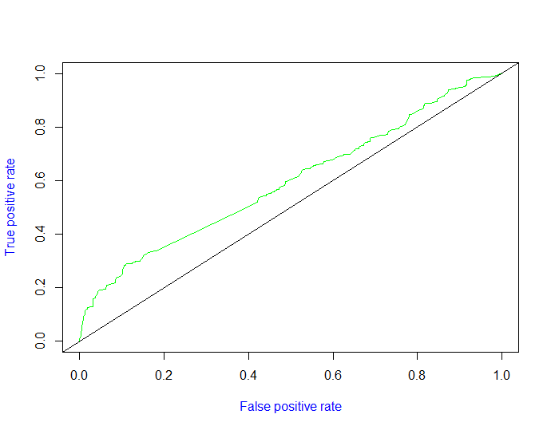

## 6. Conclusion

The restaurant industry is without a doubt one of the most cut-throat, scrutinized industries today. Many people such as owners, chefs and other employees are under immense pressure to stand out amongst competition and customers expect to have a good experience when investing in a meal.  Therefore, it was a valuable exercise for us to inspect and analyze Las Vegas restaurant reviews.

Briefly, to re-visit our project goal, we wanted to analyze the sentiment of the Yelp reviews. Therefore, after conducting sentiment analysis, we were able to pinpoint key attributes within the reviews including specifically understanding the relationship between frequently used words and identifying the number of positive and negative words and emotions that appear for each review rating (between 1 to 5 stars).

As we mention before, there are multiple ways to approach sentiment analysis, and we tried to use both dictionary-based and machine learning algorithms to get results on this topic. We can conclude that our first machine learning approach was more accurate than the second approach, so would be better to apply either the random forest or the logistic regression models from the first approach explained before.However, the  difference in performance between the models using different approaches open a question whether or not we can be facing overfitting. This is a point we leave for futher discussion and deep analysis for the future. 

After going through the entire process of sentiment analysis, it was clear why this is an important analytical tool for businesses to understand customer perceptions about their brand. Through realizing the potential applications of sentiment analysis, perhaps it would have been better for us to focus on a specific restaurant with enough (several thousand) reviews. This way, we could have built our model to cater to a specific restaurant, and our results could be interpreted and used in applications to improve specific areas of that restaurant such as marketing, customer service or even focus on competitive advantage.
